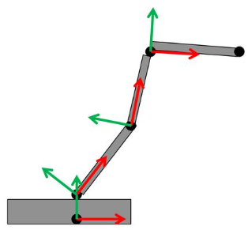
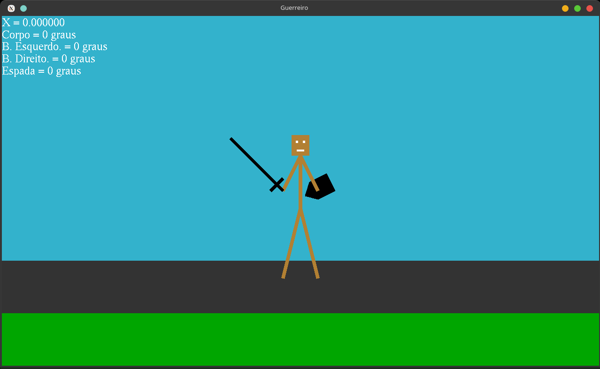

# 2ª Atividade - Hierarquia e transformações geométricas

Criar um objeto gráfico no OpenGL, que tenha uma hierarquia de objetos com, no mínimo, 3 níveis e que tenha transformações geométricas. A manipulação desse objeto poderá ser via teclado e/ou mouse.
Na figura exemplo, temos uma hierarquia de 4 níveis sendo o nível 1 a base e cada um dos "3 braços" forma um nível. Ao mover a base, toda a estrutura é movida. Ao movimentar cada braço, somente o braço movido, os demais, de hierarquias inferiores também movimentam-se. Apenas o braço final, ao ser movimentado, é afetado pelo movimento.
Podem usar estruturas humanas, robô, veículos, objetos articulados em geral.



### Instalar Biblioteca

```sh
sudo apt install freeglut3-dev
```

### Compilar e Executar

```sh
g++ main.cpp draw.cpp keyboard.cpp -o main -Iinclude -lGL -lglut -lGLU && ./main
```

### Movimentos

[ :arrow_up: ] = Levanta os dois braços

[ :arrow_down: ] = Abaixa os dois braços

[ :arrow_left:  :arrow_right: ] = Move para esquerda e para direita

[ `Q` ] = Gira o corpo para esquerda

[ `W` ] = Gira o corpo para direita

[ `S` ] = Levanta o braço esquerdo

[ `X` ] = Abaixa o braço esquerdo

[ `D` ] = Levanta o braço direito

[ `C` ] = Abaixa o braço direito

[ `A` ] = Levanta a espada

[ `Z` ] = Abaixa a espada

### Screenshot


